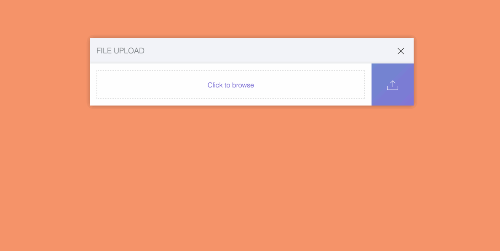

# Upload Box

Upload Box is a html5 file uploader. The main feature is:

- Beautiful UI (^_^)
- Support progress update
- Support file type filter
- Tiny and pure Javascript, no other dependency
- Use Es2016
- Easy to use

## Demo



## How to use ?
```javascript
const Uploader = require('./uploader');
new Uploader('.upload-container', { 'url': 'http://127.0.0.1:9999' }).do();
```

## How to build ?
```
npm install
npm run build && npm run dev
visit: http://127.0.0.1:8080/demo.html
```

## How to deploy
```
npm run release
```

## Licence

MIT

## Thanks

Thanks to [Athul Athreya](https://dribbble.com/shots/2440429-Day-08-File-Upload-UI/attachments/474676)
